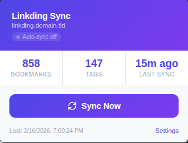
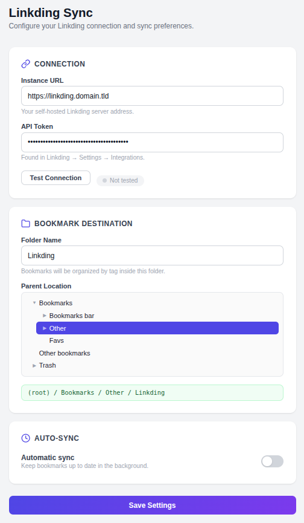

# Linkding Sync

A browser extension that syncs bookmarks from your self-hosted [Linkding](https://github.com/sissbruecker/linkding) instance into your browser's bookmark tree, organized by tags.

Works with Chrome, Vivaldi, Edge, Brave, and other Chromium-based browsers.



## Features

- Syncs all bookmarks from Linkding into a dedicated browser bookmark folder
- Organizes bookmarks into subfolders by tag
- Bookmarks with multiple tags appear in each tag's folder
- Untagged bookmarks are placed in an "Untagged" folder
- Optional automatic background sync on a configurable interval
- Choose any bookmark folder as the sync destination
- Settings sync across devices via `chrome.storage.sync`

## Installation

There is no build step required — the extension is plain JS/HTML/CSS.

1. **Download the repository**

   Clone with git:
   ```
   git clone https://github.com/klppl/linkding-sync.git
   ```
   Or download and extract the [ZIP archive](https://github.com/klppl/linkding-sync/archive/refs/heads/main.zip).

2. **Load the extension in your browser**

   - Open your browser's extension page:
     - Chrome: `chrome://extensions/`
     - Vivaldi: `vivaldi://extensions/`
     - Edge: `edge://extensions/`
     - Brave: `brave://extensions/`
   - Enable **Developer mode** (toggle in the top-right corner)
   - Click **Load unpacked**
   - Select the `linkding-sync` folder you cloned or extracted

3. **Configure the extension**

   - Click the Linkding Sync icon in your toolbar, then click **Settings** (or right-click the icon and choose **Options**)
   - Enter your Linkding instance URL (e.g. `https://linkding.domain.tld`)
   - Enter your API token (found in Linkding under **Settings > Integrations**)
   - Click **Test Connection** to verify
   - Choose a folder name and parent location for your synced bookmarks
   - Optionally enable automatic sync
   - Click **Save Settings**



## Usage

Click the extension icon and press **Sync Now** to sync your bookmarks. The popup displays the number of bookmarks and tags synced, along with the time of the last sync.

If auto-sync is enabled, the extension will sync in the background at your chosen interval.

## Linkding API Token

To get your API token:

1. Open your Linkding instance in a browser
2. Go to **Settings > Integrations**
3. Copy the API token shown on that page

## License

MIT
