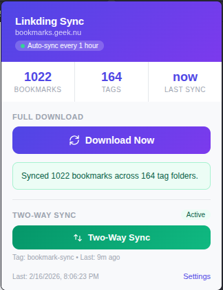
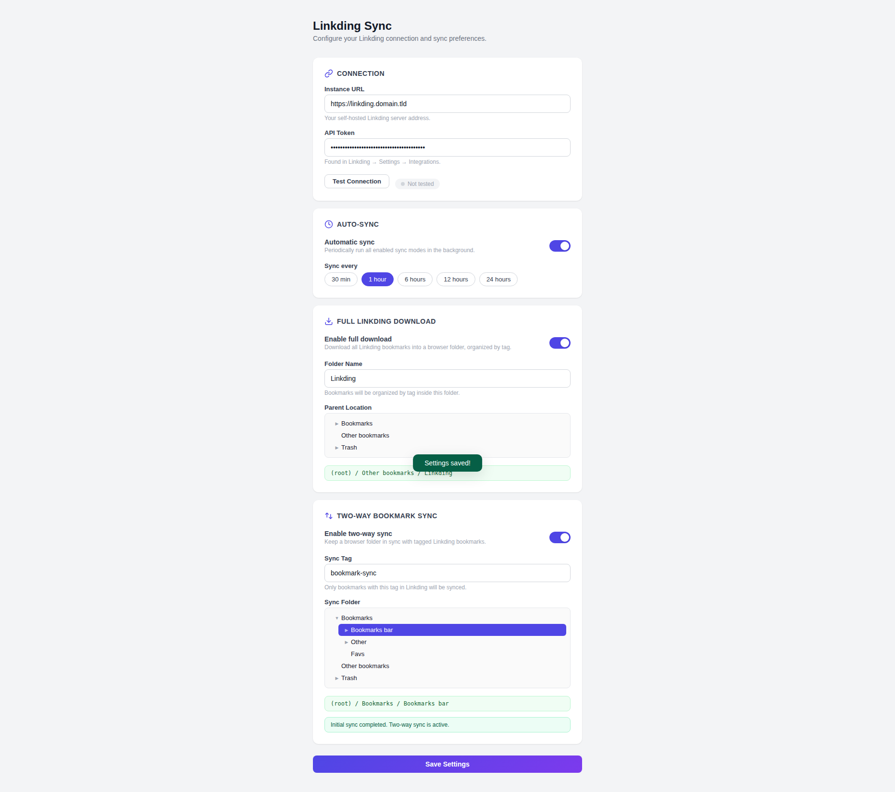

# Linkding Sync

A browser extension that syncs bookmarks from your self-hosted [Linkding](https://github.com/sissbruecker/linkding) instance into your browser's bookmark tree, organized by tags.

Works with Chrome, Vivaldi, Edge, Brave, and other Chromium-based browsers.



## Features

### Full Linkding Download

- Syncs all bookmarks from Linkding into a dedicated browser bookmark folder
- Organizes bookmarks into subfolders by tag
- Bookmarks with multiple tags appear in each tag's folder
- Untagged bookmarks are placed in an "Untagged" folder
- Optional automatic background sync on a configurable interval
- Choose any bookmark folder as the sync destination
- Settings sync across devices via `chrome.storage.sync`

### Two-Way Bookmark Sync

- Keep a browser folder (e.g. Bookmark Bar) in sync with Linkding bookmarks that share a specific tag
- Bidirectional: add a bookmark in Chrome and it appears in Linkding, or add one in Linkding and it appears in Chrome
- Full subfolder support — folder structure is preserved using path-based tags (e.g. `bookmark-sync/Work/Projects`)
- Deleting a bookmark on either side removes it from the other on the next sync
- Title and folder changes are detected and synced in both directions
- Real-time sync: bookmark changes in Chrome trigger a sync automatically (2-second debounce)
- Three initial sync modes: **Push** (Chrome to Linkding), **Pull** (Linkding to Chrome), or **Merge** (combine both, no duplicates)
- Runs alongside the full download without interference
- Both sync modes share a single **Auto-Sync** timer — enable either or both independently

## Installation

There is no build step required — the extension is plain JS/HTML/CSS.

1. **Download the repository**

   Clone with git:
   ```
   git clone https://github.com/klppl/linkding-sync.git
   ```
   Or download and extract the [ZIP archive](https://github.com/klppl/linkding-sync/archive/refs/heads/main.zip).

2. **Load the extension in your browser**

   - Open your browser's extension page:
     - Chrome: `chrome://extensions/`
     - Vivaldi: `vivaldi://extensions/`
     - Edge: `edge://extensions/`
     - Brave: `brave://extensions/`
   - Enable **Developer mode** (toggle in the top-right corner)
   - Click **Load unpacked**
   - Select the `linkding-sync` folder you cloned or extracted

3. **Configure the extension**

   - Click the Linkding Sync icon in your toolbar, then click **Settings** (or right-click the icon and choose **Options**)
   - Enter your Linkding instance URL (e.g. `https://linkding.domain.tld`)
   - Enter your API token (found in Linkding under **Settings > Integrations**)
   - Click **Test Connection** to verify
   - Optionally enable **Auto-Sync** and choose an interval
   - Enable **Full Linkding Download** and/or **Two-Way Bookmark Sync** (see below)
   - Click **Save Settings**



## Usage

### Full Linkding Download

Enable this in Settings, choose a folder name and parent location, then click **Download Now** in the popup. The popup displays the number of bookmarks and tags synced, along with the time of the last sync.

If auto-sync is enabled, all active sync modes run in the background at your chosen interval.

### Two-Way Bookmark Sync

1. Open **Settings** and scroll to the **Two-Way Bookmark Sync** card
2. Enable the toggle
3. Set a **Sync Tag** (default: `bookmark-sync`) — only Linkding bookmarks with this tag will be synced
4. Pick a **Sync Folder** in the browser (e.g. Bookmark Bar) — this folder and all its subfolders will be kept in sync
5. Save settings, then choose an **Initial Sync Mode**:
   - **Merge** — matches bookmarks by URL across both sides, uploads Chrome-only bookmarks, downloads Linkding-only bookmarks
   - **Push** — uploads everything from the Chrome folder to Linkding
   - **Pull** — clears the Chrome folder and downloads all tagged Linkding bookmarks
6. Click **Start Initial Sync**

After the initial sync, two-way sync runs automatically whenever you add, remove, or move bookmarks in the synced folder. You can also trigger it manually from the popup.

#### How folder structure works

Browser subfolder paths are encoded as Linkding tags:

| Browser location | Linkding tags |
|---|---|
| `Bookmark Bar/example.com` | `bookmark-sync` |
| `Bookmark Bar/Work/example.com` | `bookmark-sync`, `bookmark-sync/Work` |
| `Bookmark Bar/Work/Projects/example.com` | `bookmark-sync`, `bookmark-sync/Work/Projects` |

This means you can control where a bookmark lands in Chrome by adding the right path tag in Linkding. For example, adding tag `bookmark-sync/Recipes` to a Linkding bookmark will place it in a `Recipes` subfolder on the next sync.

## Linkding API Token

To get your API token:

1. Open your Linkding instance in a browser
2. Go to **Settings > Integrations**
3. Copy the API token shown on that page

## License

MIT
